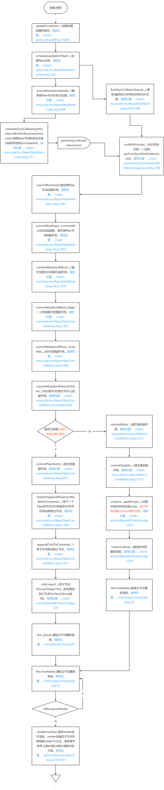
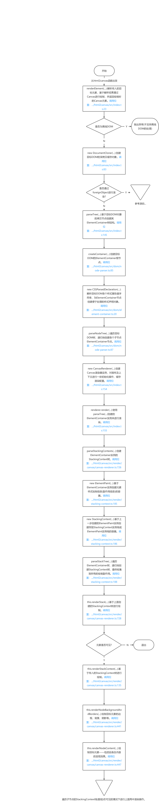
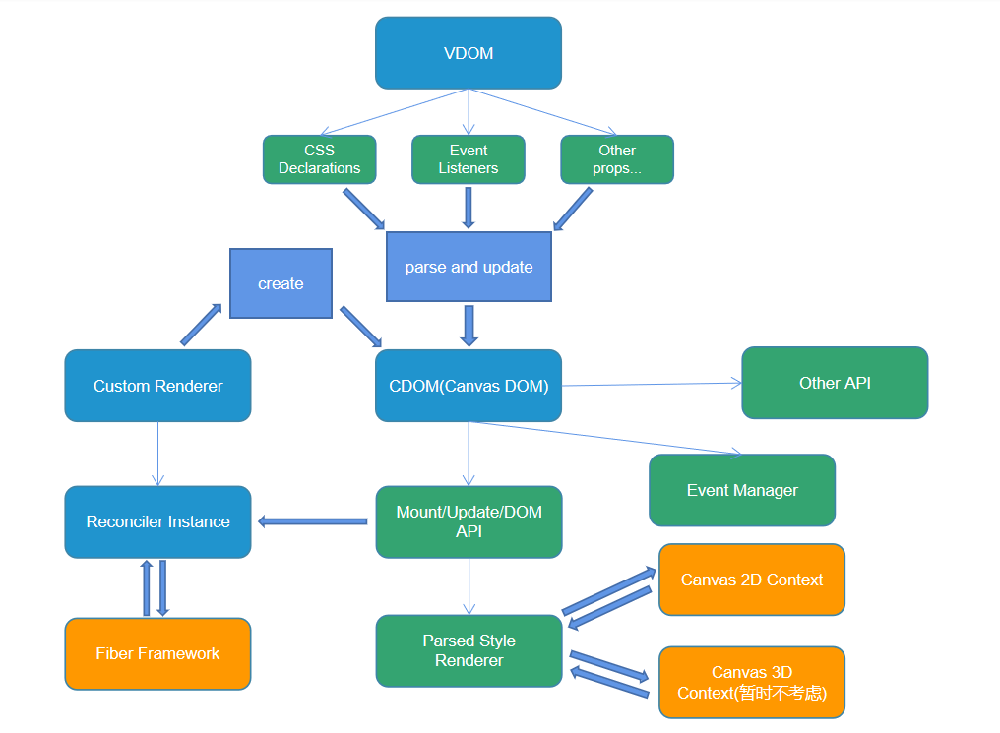
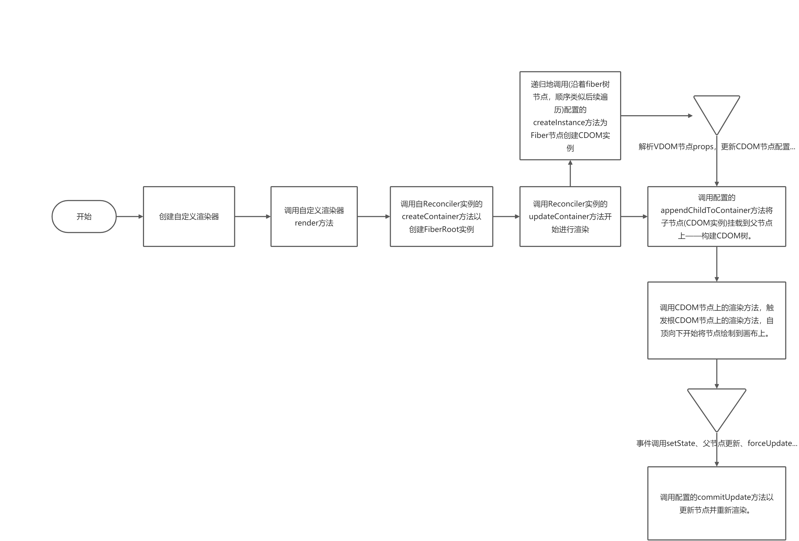
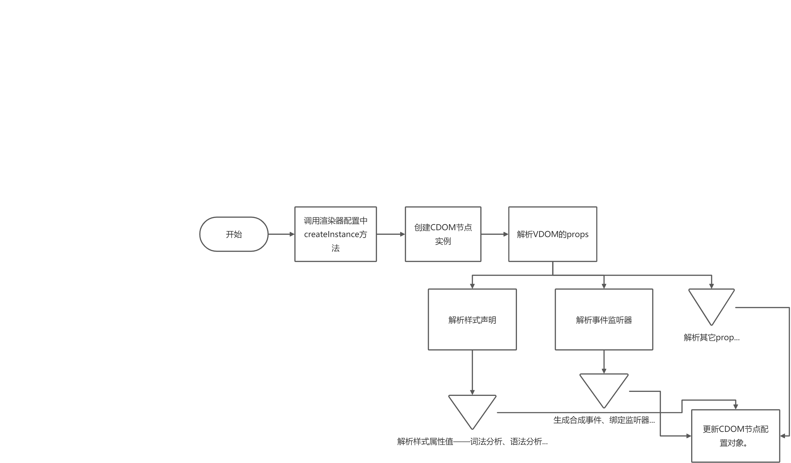

> 负责人：铀矿-萧力夫


<a name="KXt1V"></a>

### 项目背景
**立项的原因:**

1. 操作DOM无法满足一些功能需求(比如需要控制到像素级别的功能)，DOM渲染也存在一定性能问题。
1. 对于DOM转图片这样频率较高的需求，需要先从VDOM渲染为DOM，然后再借助html2canvas这样的第三方库进行最终的转化，中间多了一步不必要的转化，效率较低。

**要解决的问题:**

1. 设计师中台着手于打造的类似PS这样的RIA编辑器，对于这样的需求，传统的DOM渲染方案具有功能、性能等方面的限制，Canvas渲染方案正是为了解决这些问题。

**要实现的目标:**

1. 实现一个基于Canvas进行渲染的满足大部分DOM渲染需求的库或模块以替代react-dom(提供的渲染API)，最终实现完全Canvas化。


<a name="6QE3y"></a>

### 同领域方案

**说明**：**下面描述(包括流程图)的组件/函数的源文件路径中省略部分为你本地克隆的项目的路径位置，相关描述为个人理解，更多细节请参考源码。**

**react-art**

**简介：** react-art是对art库进行的基于react的封装，是一个利用react绘制矢量图的库，目前已经被react官方集成到了其monorepo公共库中。react-art主要利用canvas渲染图形，也兼容IE。

**核心组件/函数：**

**[art](https://github.com/sebmarkbage/art):**

1. **Class:** mixin函数，将传入的对象或函数原型合并为一个原型对象，以此为原型创建一个构造函数。ps: 之所以有这个函数，多半是因为art库编写时间较早——八九年前，而作者貌似是facebook开源团队成员。代码路径：.../art/core/class.js
2. **Transform:** 用于节点变换的基类，实现的变换包括仿射(任意线性变换接平移)、平移、旋转、缩放，还包括坐标系的变换(嵌套坐标系之间的切换)。代码路径：.../art/core/transform.js
3. **Path:** 用于线条/路径绘制的基类，实现了圆弧、贝塞尔曲线(二次)、自由曲线等的相关参数的计算方法，也提供了通过SVG路径来绘制线条的方法，其中关于绘制的方法需要在子类中实现或重写。代码路径：.../art/core/path.js
4. **Dummy(Element):** 图形组件的Element基类，实现了Element关于节点控制(移除、插入等)以及事件处理相关的接口——因为绘制在画布的图形不是真实的DOM，所以需要手动实现这些接口，这里提供的接口供ReactARTHostConfig中DOM节点控制相关的函数(appendChild、insertBefore、removeChild...)使用。代码路径：.../art/dom/dummy.js
5. **Native(Element):** 图形组件容器组件的Element基类，实现的功能和Dummy比较相近。代码路径：.../art/dom/native.js
6. **Surface:** 绘制形状图形的最外层的容器组件，继承了Native，对应真实的DOM——页面中的一个canvas元素，核心实现细节：

    - 通过render重置画布并重绘图形(通过调用图形组件实例的方法)；
    - 通过hitTest方法判断是否与图形(图形组件实例)发生交互。
    - 通过dispatch方法在存在新的交互时进行事件分发。

    代码路径：.../art/modes/canvas/surface.js

7. **Node:** 图形组件的基类，继承了Transform和Dummy，用于让图形组件具有DOM节点的部分特性。核心实现细节：

      -   通过renderTo方法进行重绘(调用图形组件实例的renderLayerTo)或重置画布(重置变换、清空画布内容)。
      -   通过hitTest方法先将相对于父节点的交互坐标转化为相对于节点自身坐标系的坐标，然后再调用localHitTest方法判断是否发生交互(交互坐标是否位于节点范围/路径内)。

    代码路径：.../art/modes/canvas/node.js
8. **Group:** 用于存放图形组件及其它Group实例的容器组件，继承了Node，主要用于实现整体(多个图形组件)变换。核心实现细节：

      -   通过renderLayerTo方法在执行子节点变换前先进行整体变换。

    代码路径：.../art/modes/canvas/group.js
9. **Base:** 图形组件的基类，继承了Node，封装了一些类似画刷的方法——纯色、径向渐变、线性渐变、图像等画刷。代码路径：.../art/modes/canvas/base.js
10. **Shape:** 形状图形组件，继承了Base，用于进行形状图形的绘制。核心实现细节：

      -   通过renderShapeTo方法遍历执行缓存的路径绘制回调，然后根据用当前笔刷将图形绘制到画布上。
      -   通过localHitTest方法判断交互坐标是否在形状的路径/范围内，是则返回当前图形组件，否则返回null。
      -   通过draw方法生成路径绘制回调的数组缓存，也可以通过此方法重置画布尺寸。

    代码路径：.../art/modes/canvas/shape.js

**[react-art](https://github.com/facebook/react/tree/master/packages/react-art):**
1. **Surface:** 集成了art中Surface组件，核心实现细节：
    - 通过React类组件生命周期进行初始化(挂载)和更新——挂载完成时调用createContainer基于创建的Surface实例创建宿主fiber节点，然后调用updateContainer进行对应画布上图形的挂载和更新。

    代码路径：.../react/packages/react-art/src/ReactART.js

2. **createInstance:** 用于在fiber提交副作用(completeWork)时创建图形组件实例(相当于VDOM)——即可以像使用内置组件一样使用art中Group、Shape、Text、ClippingRectangle等图形组件。具体过程为先创建图形组件实例，然后通过applyXXXProps(XXX表示Group/Shape/Text...)对组件实例应用props，最后返回该实例。代码路径：.../react/packages/react-art/src/ReactARTHostConfig.js
3. **commitUpdate:** 用于更新图形组件的props，也是调用applyXXXProps方法。代码路径：.../react/packages/react-art/src/ReactARTHostConfig.js
4. **appendChild:** 用于将子节点(Group或图形节点)附加到父节点(Surface或Group)上，若已附加则从父节点上移除该节点。代码路径：.../react/packages/react-art/src/ReactARTHostConfig.js
5. **appendChildToContainer:** 功能和appendChild一样。代码路径：.../react/packages/react-art/src/ReactARTHostConfig.js
6. **insertBefore:** 用于在兄弟节点前插入目标子节点。代码路径：.../react/packages/react-art/src/ReactARTHostConfig.js
7. **insertInContainerBefore:** 功能和insertBefore一样。代码路径：.../react/packages/react-art/src/ReactARTHostConfig.js
8. **removeChild:** 用于将子节点从父节点上移除。代码路径：.../react/packages/react-art/src/ReactARTHostConfig.js
9. removeChildFromContainer: 功能和removeChild一样。代码路径：.../react/packages/react-art/src/ReactARTHostConfig.js

**核心流程：**

提示：下面的流程图描述的是react-art挂载/更新的调用流程(对应相应的调用栈)，每一步描述了调用的作用及所在代码路径及行数，对应react版本为17.0.1，react-art版本为17.0.2，react-reconciler(用于创建自定义渲染器，引入了fiber架构)版本为0.26.1。



**借鉴意义：**

react-art通过将art集成到react内部，提供了一些可用于绘制矢量图形的react内置组件，通过研究其核心实现细节，我们能够了解react自定义渲染器以及fiber架构的部分实现细节；而art库内部实现是一套完整的将画布上的图形封装为类DOM的解决方案，其中关于事件管理的实现思路值得参考。

**不足之处：**

   1. react中自定义渲染器还需深入了解，react-art的自定义渲染器配置是直接集成在React内部，提供的挂载/更新的接口在Fiber架构内部被直接引入，且配合react源码中的打包脚本才能生效。所以react-art中自定义渲染方案的参考价值不大。
   1. art库只实现了绘制矢量图形的解决方案，相比于DOM而言，样式上比较简单也不够丰富，所以art中的样式方案参考价值也不大。

**html2canvas**

**简介：**
html2canvas是一个用于在前端通过接口调用生成页面截图或部分内容截图的库。其内部实现了一套CSS解析(词法、语法分析)机制，通过解析结果基于canvas(2D)进行绘制，能满足大部分DOM转Canvas渲染的需求。

**核心组件/函数：**
1. **html2canvas:** html2canvas库导出的唯一一个接口(函数)，用于对传入的目标元素(第一个参数)的内容(结构和样式)进行解析，然后渲染到一个Canvas元素上，最后返回该Canvas元素。代码路径：.../html2canvas/src/index.ts:22
2. **renderElement:** 调用html2canvas时实际执行的函数，html2canvas是其简单封装，两者唯一区别在于第二个作为配置对象的参数对于html2canvas是可选的，而renderElement的则不是。代码路径：.../html2canvas/src/index.ts:32
3. **DocumentCloner:** 对目标DOM对象进行拷贝的封装类型，初始化时传入的DOM对象必须是在线的，拷贝时会对整个DOM树(document.documentElement)进行深拷贝，而创建的实例的clonedReferenceElement为目标DOM对象的拷贝节点。代码路径：.../html2canvas/src/dom/document-cloner.ts:46
4. **CSSParsedDeclaration:** 经过解析的样式声明类型，且只支持部分样式属性，支持的样式属性值类型被转化为方便处理的类型——数组、枚举(数字)、令牌(节点对象)等。代码路径：.../html2canvas/src/css/index.ts:140
5. **ElementContainer:** 用于进行渲染的基于真实DOM创建的伪DOM类型，因为是用于描述渲染的封装类型，所以重点在于内容属性(文本节点或value)以及解析得到样式声明属性(CSSParsedDeclaration实例)，另外还有多个子类型，不同子类型有各自特定的属性。代码路径：.../html2canvas/src/dom/element-container.ts:19
6. **parseTree:** 基于目标DOM对象的拷贝节点创建其ElementContainer树(会遍历拷贝的节点的所有子孙并创建对应的ElementContainer节点)。代码路径：.../html2canvas/src/dom/node-parser.ts:84
7. **CanvasRenderer:** Canvas渲染器的封装类型，用于对画布及上下文进行一些初始化操作，缓存渲染配置。代码路径：.../html2canvas/src/render/canvas/canvas-renderer.ts:70
8. **ElementPaint:** 元素绘制信息(副作用信息)的容器类型，将元素的布局相关的属性转化为多个不同类型的副作用的数组。代码路径：.../html2canvas/src/render/stacking-context.ts:40
9. **StackingContext:** 按照类型划分存放StackingContext实例栈或ElementPaint实例栈的容器类型。代码路径：.../html2canvas/src/render/stacking-context.ts:22
10. **render:** CanvasRenderer的实例方法，用于通过传入的ElementContainer实例进行渲染——先创建目标节点的StackingContext实例，然后遍历上面的各个栈，通过栈中元素的ElementPaint实例来进行绘制。代码路径：.../html2canvas/src/render/canvas/canvas-renderer.ts:715

**大致流程：**

*提示：下面的流程图描述的是html2canvas函数的流程的简略版本，详细的流程请参考源码，对应的代码版本为：1.0.0-rc.7。*



**借鉴意义：**

*html2canvas提供了一套较完善的DOM to Canvas的方案，VDOM to Canvas和这套方案的目的非常类似，其中的CSS解析、通过树形结构组织节点绘制副作用以及具体的绘制算法都有极高的参考价值。*

**不足之处：**

1. 对目标节点进行拷贝时，对整个DOM树进行了拷贝，对于结构较复杂或比较大的页面(动态增加)这种操作势必会降低性能，并且拷贝得到的这个根DOM树暂时没发现适用场景。
2. 只实现了部分CSS样式(可以理解)，且有些样式根本没有解析的必要，比如外边距——html2canvas内部实现中是通过getBoundingClientRect()来获取元素定位的，所以没必要解析外边距样式属性。
3. 执行绘制的函数将几类样式属性的渲染杂糅在一起，有点臃肿且不利于拓展，比如将背景和边框的渲染合并到一个函数中，但这个函数又包含阴影的渲染的实现，且其中的流程有点跳跃不是很容易理解。
4. 关于副作用这一块，在其内部实现中显得有点鸡肋且局限——只用于描绘形状路径，但在内容绘制时部分场景也没有起到描绘形状的作用，并且CSS样式属性太多且比较灵活，某些样式之间会互相影响，将配置对象改为类似事件处理器的方式去执行绘制更合适一点。


<a name="yhtF4"></a>
### 可行性分析

**难点分析**

1. 抛开选择器、动画、过渡等不管，CSS提供的样式属性非常丰富，且有些样式机制还比较复杂，比如：flex/grid/column布局、图形效果(filter)、3D效果(perspective、transform等)。此外DOM丰富的交互控制API——事件、DOM操作等若要实现一部分也是比较麻烦。
2. 上面提到的两点只是目前考虑到的不好处理的点，可能还有其它暂时漏掉的比较重要关注点，所以在前期设计上要特别注重灵活性/扩展性/内聚性，否则可能导致后续出现架构上的大漏洞。
3. 就目前调研的结果而言，使用Canvas2D能满足大部分应用场景，但以后某些样式或场景可能存在2D无法实现的情况，但使用Canvas3D进行开发存在一定门槛，WebGL/WebGL2提供的API比2D多得多，就算使用three.js等第三方库，也还是需要学习GLSL以及一些图形学相关算法(涉及线性代数、高数等数学基础)，总之3D的应用场景一旦涉及的话，如果不具备相关技术栈及理论知识，那么短期内无法上手。

**可行性**

1. React支持自定义渲染器(react-reconciler包)，不用担心需要实现一个对标react-dom的核心库，且相关API满足目前设计中台的所有需求。
2. 设计中台目前主要用于图片和文本的编辑操作，Canvas2D能满足绝大多数需求，而3D相关场景可以在以后业务扩展或团队实力达标后再考虑。
3. 关于目前Canvas渲染方案(VDOM to Canvas)的重点——样式模拟，在html2canvas中有一套现行方案可以参考；而在交互上的，art库中也有一套关于画布元素事件管理的方案可以参考。


<a name="BW1qC"></a>

### 实现路径

整体组成部分如下：



**实现路径大致流程为：创建自定义渲染器 => 创建FiberRoot实例 => VDOM to CDOM(暂定) => 挂载，渲染(到Canvas画布上) => 更新 => ...，挂载和渲染通过调用自定义渲染器实例的方法即可完成，后续通过setState等方式触发更新时，Fiber架构内部替我们完成更新(需要在渲染器配置中提供用于更新的方法)。具体细节如下：**



**关于VDOM转CDOM，CDOM为解析后的具有样式、事件监听器等配置信息以及绘制方法的节点实例，这一步的细节如下：**


<a name="HRSaO"></a>

### 代码实例

下面是一个简单的demo：

```typescript
import React, { useState, useCallback } from 'react';
const ReactReconciler = require('react-reconciler');

type FakeElementProps = {
  style: Record<string, string>;
  onClick: VoidFunction;
};

class SimpleFakeElement {
  private style: CSSStyleDeclaration | null = null;
  private hostCtx: CanvasRenderingContext2D;
  private binded = false;

  constructor(canvas: HTMLCanvasElement) {
    this.hostCtx = canvas.getContext('2d') as CanvasRenderingContext2D;
  }

  inspectProps({ style, onClick }: FakeElementProps) {
    this.style = (style as unknown) as CSSStyleDeclaration;
    if (!this.binded) {
      this.binded = true;
      this.hostCtx?.canvas.addEventListener('click', onClick);
    }
  }

  renderContent() {
    if (!this.style) {
      return;
    }
    const { marginLeft, marginTop, width, height, background } = this.style;
    const { hostCtx } = this;
    const x = +marginLeft || 0;
    const y = +marginTop || 0;
    const w = +width || 100;
    const h = +height || 100;
    const fillStyle = background || 'white';
    hostCtx.fillStyle = fillStyle;
    hostCtx.beginPath();
    hostCtx.moveTo(x, y);
    hostCtx.lineTo(x + w, y);
    hostCtx.lineTo(x + w, y + h);
    hostCtx.lineTo(x, y + h);
    hostCtx.closePath();
    hostCtx.fill();
  }
}

type RootContext = { rootContainer: HTMLCanvasElement };
type HostContext = { rootContainer: HTMLCanvasElement; type: string };

const hostConfig = {
  getRootHostContext(rootContainer: HTMLCanvasElement): RootContext {
    console.log('getRootHostContext', rootContainer);
    return { rootContainer };
  },

  getChildHostContext(
    context: HostContext,
    type: string,
    rootContainer: HTMLCanvasElement
  ): HostContext {
    console.log('getChildHostContext', context, type, rootContainer);
    return { rootContainer, type };
  },

  /** 是否将当前节点作为文本处理 */
  shouldSetTextContent(type: string, nextProps: Record<string, any>): boolean {
    console.log('shouldSetTextContent', type, nextProps);
    return (
      !!nextProps.children &&
      (typeof nextProps.children === 'string' ||
        typeof nextProps.children === 'number')
    );
  },

  // 创建节点实例
  createInstance(
    type: string,
    newProps: FakeElementProps,
    rootContainer: HTMLCanvasElement,
    hostContext: HostContext,
    workInProgress: Record<string, any>
  ): SimpleFakeElement {
    console.log(
      'createInstance',
      type,
      newProps,
      rootContainer,
      hostContext,
      workInProgress
    );
    const fakeElement = new SimpleFakeElement(rootContainer);
    fakeElement.inspectProps(newProps);
    fakeElement.renderContent();
    return fakeElement;
  },

  // 创建文本节点实例
  createTextInstance(
    newText: string,
    rootContainer: HTMLCanvasElement,
    hostContext: HostContext,
    workInProgress: Record<string, any>
  ): string {
    console.log(
      'createTextInstance',
      newText,
      rootContainer,
      hostContext,
      workInProgress
    );
    return newText;
  },

  // 把节点附加到节点树中
  appendInitialChild(
    parent: HTMLCanvasElement,
    child: SimpleFakeElement
  ): void {
    console.log('appendInitialChild', parent, child);
    // 此demo中啥也不用做
  },
  appendChildToContainer(
    parent: HTMLCanvasElement,
    child: SimpleFakeElement
  ): void {
    console.log('appendChildToContainer', parent, child);
  },
  removeChildFromContainer(
    parent: HTMLCanvasElement,
    child: SimpleFakeElement
  ): void {
    console.log('removeChildFromContainer', parent, child);
  },

  // 更新，可以用来判断要不要更新
  prepareUpdate(
    instance: SimpleFakeElement,
    type: string,
    oldProps: FakeElementProps,
    newProps: FakeElementProps,
    rootContainer: HTMLCanvasElement,
    currentHostContext: HostContext
  ): boolean {
    console.log(
      'prepareUpdate',
      instance,
      type,
      oldProps,
      newProps,
      rootContainer,
      currentHostContext
    );
    return true;
  },

  // 更新
  commitUpdate: (
    instance: SimpleFakeElement,
    updatePayload: any,
    type: string,
    oldProps: FakeElementProps,
    newProps: FakeElementProps,
    finishedWork: Record<string, any>
  ) => {
    console.log(
      'commitUpdate',
      instance,
      updatePayload,
      type,
      oldProps,
      newProps,
      finishedWork
    );
    instance.inspectProps(newProps);
    instance.renderContent();
  },
  // 文本节点的求值更新
  commitTextUpdate: (instance: any, oldText: any, newText: any) => {
    console.log('commitTextUpdate', instance, oldText, newText);
  },

  prepareForCommit: (containerInfo: any) => {
    console.log('prepareForCommit', containerInfo);
  },
  resetAfterCommit: (containerInfo: any) => {
    console.log('resetAfterCommit', containerInfo);
  },

  finalizeInitialChildren: (
    instance: any,
    type: any,
    newProps: any,
    rootContainerInstance: any,
    _currentHostContext: any
  ) => {
    console.log(
      'finalizeInitialChildren',
      instance,
      type,
      newProps,
      rootContainerInstance,
      _currentHostContext
    );
  },

  clearContainer() {
    console.log('call clearContainer');
  },

  supportsMutation: true,
};

const ReactReconcilerInst = ReactReconciler(hostConfig);

const SimpleCanvasRender = {
  render: (reactElement: any, domElement: any, callback?: any) => {
    console.log('render', reactElement, domElement, callback);
    // Create a fiberRoot if it doesnt exist
    if (!domElement.fiberRoot) {
      domElement.fiberRoot = ReactReconcilerInst.createContainer(
        domElement,
        false
      );
    }

    // update the fiberRoot
    return ReactReconcilerInst.updateContainer(
      reactElement,
      domElement.fiberRoot,
      null,
      callback
    );
  },
};
const { random: rd } = Math;
function rdRGB() {
  return (~~(rd() * 255)).toString(16);
}
function SimpleApp() {
  const [style, setStyle] = useState({
    marginLeft: 20,
    marginTop: 30,
    background: 'indianred',
  });
  const onClick = useCallback(() => {
    setStyle((style) => ({
      ...style,
      background: `#${rdRGB()}${rdRGB()}${rdRGB()}`,
    }));
  }, [setStyle]);
  return <div style={style} onClick={onClick}></div>;
}
SimpleCanvasRender.render(<SimpleApp />, document.getElementById('canvas1'));
```


<a name="zOZVx"></a>

### 迭代计划

**根据目前的调研分析结果，暂定需要三个阶段(工时待定)：**

1. 第一个阶段预计需要2人，这个阶段的目标是确定VDOM to Canvas的功能范围(边界/白名单)，然后设计、实现一个大致的架构，并完成一个核心机制的开发。
2. 第二个阶段预计需要2-3人，这个阶段主要是对标html2canvas来实现其已有的样式(不一定完全一致，还是要结合上一阶段确定的功能范围)，在交互上实现事件管理机制，适配常用的事件。
3. 第三个阶段预计需要2-3人，这个阶段的目标是结合业务需求进行功能(样式/交互)扩展或完善已有的功能或进入beta测试阶段。
