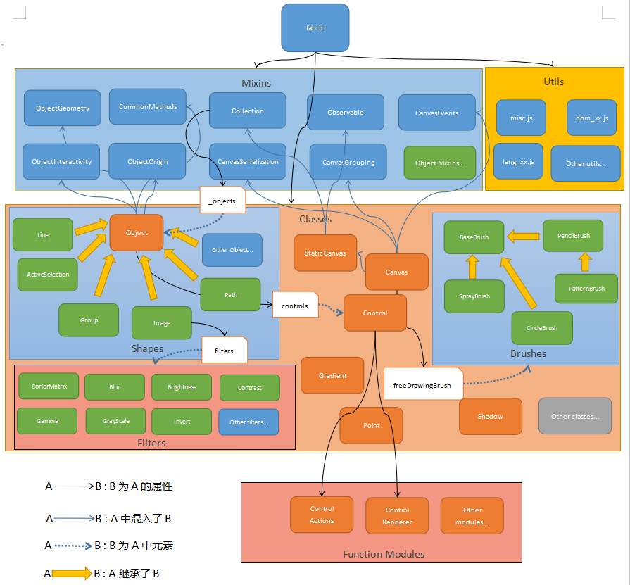
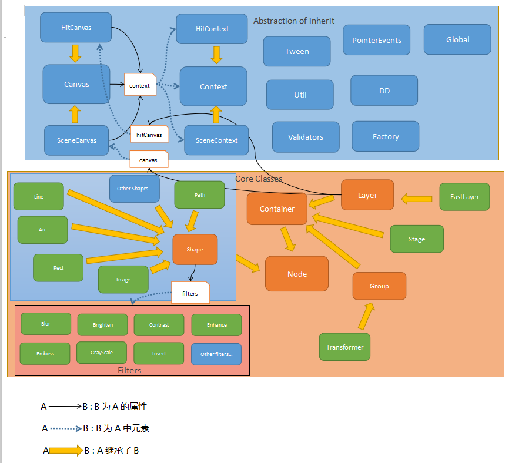
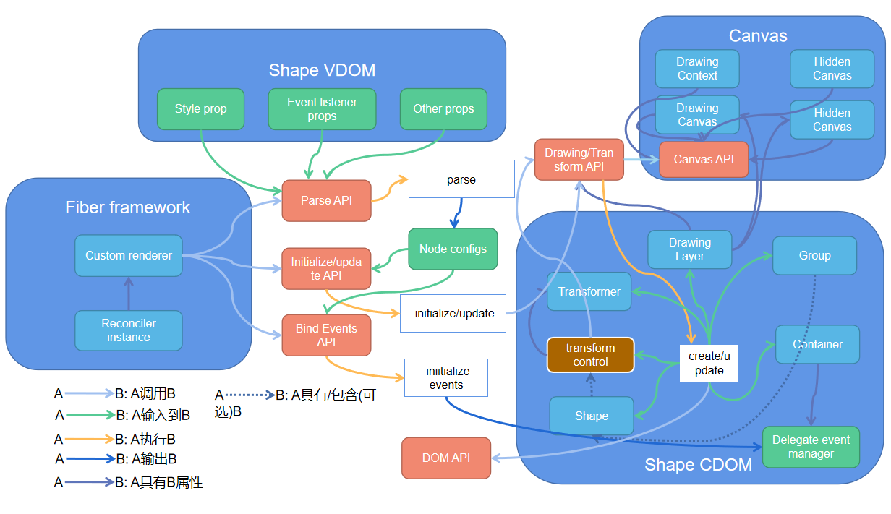

> 负责人：铀矿-萧力夫

### 回顾与目标

**上一阶段主要对两个实现效果比较类似的库进行了一些研究和总结，得到一些重要的结论和启发，不过这两个库总体来说体量比较小也比较局限——在Canvas事件模型、VDOM解析/转化与渲染等方面实现较简单或缺乏对应的实现，对于最终要达到的落地效果来说，只调研这两个库还不够，因此将继续开展第二阶段的调研以便能确定一个更加完整的可行方案。本阶段将会研究分析市面上成熟的Canvas渲染库以及React官方的VDOM渲染方案——React Native，关于Canvas渲染库将重点关注其中的渲染模型和事件模型；而对于React Native，将主要研究其中VDOM的解析、转化以及和输出相关的分层结构与过程。**

### Canvas渲染库

[**fabric.js**](https://github.com/fabricjs/fabric.js)

**分层模型/设计结构:**

****

*下面是对其中渲染相关的模型和事件模型的补充说明(更多细节参考官方文档)*

- **对象(fabric.Object)**: fabric中各种可绘制的形状(Text、Line、Path...)的基类，提供了缓存控制、变换操控(通过轮廓上的按钮控件)、鼠标/变换/事件以及通用形状属性等接口。核心的方法为_render(进行绘制)，由各形状子类进行重写以便满足特定的绘制需求。
- **集合(fabric.Collection)**: 绘制和管理对象的容器——以集合的方式管理形状对象，提供了插入、添加、删除等接口，添加和插入就是将对应的形状绘制到画布，删除则会移除该形状然后重绘所有保存在容器中的形状。
- **观察者(fabric.Observable)**: fabric中事件模型的基类，提供的接口比较简洁，只有绑定(on)、解绑(off)、触发(fire)等三个接口。
- **静态画布(fabric.StaticCanvas)**: 顾名思义，只负责绘制而不会提供变换控制(不会绘制变换控件)和事件管理的功能，继承(mixin)了集合和观察者，核心方法为renderAll，用于渲染所有的形状对象，此外还提供了层级控制的接口。
- **画布(fabric.Canvas)**: 继承了静态画布类，主要区别在于它支持变换控制(基于事件驱动)和事件管理，且事件管理是在其创建额外的画布元素上进行的，即它的实例有两层画布——lowerCanvasEl: 页面中已存在的canvas元素，进行绘制的画布元素；upperCanvasEl: 实例初始化时创建的位于lowerCanvasEl上面且尺寸相同的canvas元素，用于管理事件。此外，实例初始化时也会进行主要事件(鼠标事件和自定义事件)监听器的绑定。
- **控件动作模块(src/constrols.action.js):** 控件进行变换控制时调用的函数，也是Canvas中绑定的默认事件监听器中主要调用的函数。

**优点(已知):**

   - 提供了常见形状的绘制功能，对Canvas2D中所有功能都进行了精简封装，通过配置的方式就可以快速创建2D图形和图像，同时提供了丰富的选项来对绘制进行控制。
   - 为canvas上绘制的元素赋予了丰富的交互能力和变换操控能力，可以满足常用的图形/图像编辑能力，也能满足设计中台大部分交互、变换控制的需求。
   - 提供了丰富的图片过滤函数，包括多种滤镜、自定义图片/颜色混合、多种过滤效果混合、马赛克、像素缩放等。
   - 提供了完善的画笔和动画功能，在画笔方面通过PatternBrush可以很方便地创建给定图像的画刷；而动画方面fabric.js提供了非常丰富的缓动函数以实现各种常用的动效。

**不足之处(已知):**

   - 模块化做得不太好，由于代码比较老，当时还没有模块管理甚至class等ES特性，导致所有模块都放在fabric名称空间下，再加上手动实现class，导致继承和封装有点混乱(一些关键属性位于构造函数原型上)且每个类没有特定的类型，因此在使用时有点不方便。
   - 暴露的选项/方法过多——过于扁平化，没有进行完善的规划分类，让人不禁眼花缭乱，在实际使用中不同特性之间是否互相影响需要开发者自行摸索，在提供如此多特性的同时并没有足够的示例代码(也该也很难做到)提供参考。
   - 提供了控件可以控制绘制的元素的变换，但是没有提供这些控件按钮及边框的自定义扩展(主要是样式方面)的接口，导致这两个功能有点鸡肋。
   - 在绘制上提供的功能中规中矩，作为基础库而言不够灵活，无法满足一些复杂的绘制场景，比如：擦补画笔；提供了丰富的过滤器，但都只能用于整张图片，而不能运用于其它绘制的形状。

   [**konva**](https://github.com/konvajs/konva)

**分层模型/设计结构:**

# 

下面是对其中渲染相关的模型和事件模型的补充说明(更多细节参考官方文档)
- **Node:** 表示节点的类型，具有变换、缓存、设置层级、处理事件、获取容器、序列化、生成图片等功能，是konva中绘制的形状节点类型或管理节点的容器类型等的抽象基类。
- **Container:** 表示容器的类型，继承了Node，主要用于管理画布上绘制的实体(形状节点)或管理多个画布——负责子节点的增删改查、绘制、范围边界计算等。
- **Stage:** 表示最外层容器的类型，继承了Container，对应一个真实DOM(HTMLDivElement)，主要用于画布(Layer实例)的管理以及事件处理——通过事件代理管理所有事件，支持冒泡，Stage中还产生和绑定了核心的事件监听器，这些监听器中会根据鼠标/指针/触摸事件触发时的坐标位置判定应该响应的形状实体并触发实体上绑定的事件。
- **Layer:** 表示画布层的类型，也继承了Container，用于实例或实例组的管理——实例/实例组的增删改查、实例的绘制、自身层级的操作、交互检测等。每个Layer实例对应两层画布，一层是用于绘制的添加到真实dom树中的画布，对应的抽象类为SceneCanvas；另一层是隐藏的用于绘制交互检测区域的画布，对应的抽象类为HitCanvas，交互检测是通过颜色对照实现的——发生鼠标等事件时会判断指针位置对应的隐藏画布中(交互检测区域内)该点的像素颜色值是否为某形状的colorKey，是的话则触发交互。
- **Shape:** 表示画布中绘制形状的基类，所有支持的形状类都继承自它，其中声明了所有与绘制相关的方法和属性，最核心的方法为drawScene和drawHit。
- **Transformer:** 继承自Group(Container的简单扩展，其子元素只能是Group或Shape实例)的特殊子类，用于绘制可操控形状变换的轮廓控件(类似于fabric.js中的Control类型)，不过该类型具有较多属性可以控制绘制的轮廓控件的样式。此外，还可以利用Group创建自定义的Transformer(参考：[https://konvajs.org/docs/sandbox/Image_Resize.html](https://konvajs.org/docs/sandbox/Image_Resize.html))。

**优点(已知):**

   - 绘制功能依然非常强大，fabric.js能实现的功能它基本都能实现，除了两者在过滤器上的具有一些细微的差别——它们各自有一些特有的过滤器。
   - 相比fabric.js而言，konva的代码要新一点，在抽象层级上更加清晰，不同类拥有各自的特定类型。
   - 相比fabric.js而言要灵活很多，对画布和其context进行封装但同时又保留了所有原生API，使用者可以通过原生API开发konva没有的功能，而无需重新封装，另外在控制变换的控件上konva提供了更多的属性来修改样式，甚至可以完全自定义；konva中过滤器也是可以用于各种形状而不局限于图片。
   - konva在某些功能上进行一些优化，比如其模糊算法采用了和高斯模糊比较接近的栈模糊，在效果和性能上都强于fabric.js中模糊算法；又比如其交互检测基于键值查询且在隐藏画布上进行，所以也比fabric.js的检测机制要快一些。

**不足之处(已知):**

   - 虽然是用ts编写的，但是还不够严谨，在通过ts使用时还存在很多类型问题和错误；没有很好地利用esm的特性来处理导出，和fabric.js一样，将所有类都放到了一个名称空间中，使用起来也有点不方便。
   - 提供的配置选项依然很多，API不够精简，比如在使用过滤器时必须先调用缓存方法才能生效；另外，相比fabric.js而言，没有打包选项，引入时会将整个库引入，不是一个轻量级的库。

### React Native
(略)

**说明**：本阶段原本打算深入研究React Native关于样式属性解析、渲染等相关的实现细节以供参考，但在实际调研过程发现实际情况完全不是最初预估的那样——React Native现在有两套架构，新的ReactFabric(不是React Fabric组件库)架构打算绕过Bridge中间层直接与Native进行通信，或者说换一种机制替代Bridge以解决现有架构过分依赖Bridge导致通信成本过高从而衍生的众多问题，新的Fabric架构还在开发阶段，且开放的代码有限，暂时不用考虑研究其细节了；而现有基于Bridge通信的架构中，样式解析及渲染相关细节位于Native Bridge中(react-native-renderer中创建组件实例时只是调用了JS Bridge的API来发起一个任务放入队列中)，即调用Native组件的代码中，换而言之，平台不同(语言不同)、机制不同，因此可参考的价值不大且投入产出率较低。

### 方案总结
**概览:** 分层结构上和之前确定的方案大同小异，结合这段时间Canvas库的调研工作总结，暂定参考konva库的设计思路、模型对之前方案中的CDOM进行一定改动。
**分层结构图:** 
****

### 示例项目
